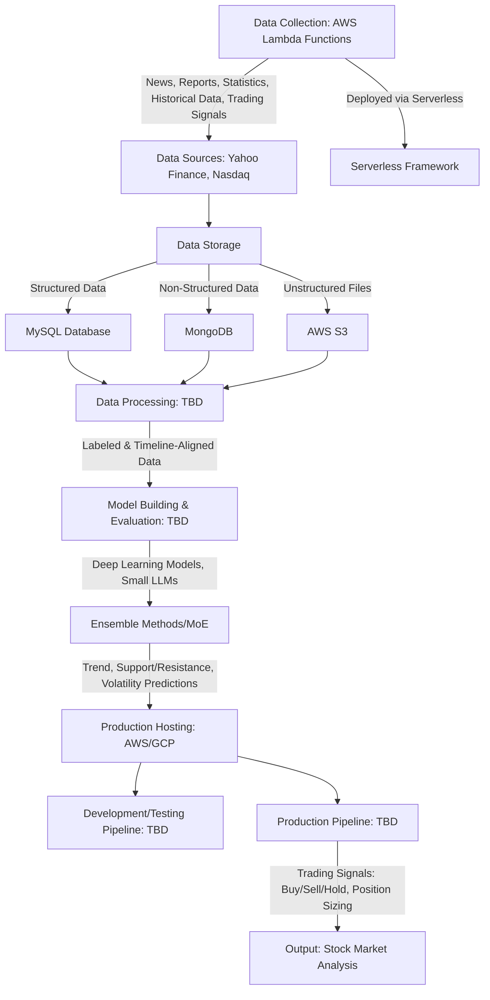

# Financial Market AI Signal System

## Overview
This project develops a system to train Large Language Models (LLMs) and Deep Learning models for multiple objectives: predicting financial market trends, identifying support and resistance levels, forecasting volatility, and other related tasks (e.g., risk assessment). The system collects financial data from various sources using AWS Lambda functions, processes it, trains models, and deploys them to generate actionable insights for stock market analysis. The architecture supports diverse data sources, robust storage, and scalable cloud-based deployment, with ensemble methods and a Mixture of Experts (MoE) framework to combine predictions into robust trading signals. Model training leverages GPU-accelerated environments, such as the NVIDIA TensorFlow Docker container, for efficient computation.

## System Components
The system is divided into the following key components:

1. **Data Collection**:
   - Collects news, financial reports, company quarterly/annual reports, financial statistics, historical stock data, and trading strategy signals.
   - Uses multiple AWS Lambda functions, each tailored to collect specific data types (e.g., news, historical data, technical indicators) from different sources.
   - Lambda functions are deployed and managed using the Serverless Framework.

2. **Data Sources**:
   - Primary sources: Yahoo Finance and Nasdaq.
   - Data includes structured (numerical/statistical) and unstructured (reports, news) formats.

3. **Data Storage**:
   - **MySQL Database**: Stores structured data like financial statistics and historical data.
   - **MongoDB**: Stores non-structured data such as news articles and financial reports.
   - **AWS S3**: Stores unstructured files like chart images and other documents.

4. **Data Processing**:
   - Organizes news, reports, and statistics with timeline-based labels.
   - Processes technical indicator charts and trading signals, aligning them with timelines for model input (e.g., for trend prediction, support/resistance levels, and volatility).
   - Processing logic is under development and will be defined in future scripts.

5. **Model Building and Evaluation**:
   - Trains and fine-tunes Deep Learning models and small LLMs on specific data types (e.g., news sentiment for trends, technical indicators for support/resistance, option data for volatility).
   - Evaluates models for accuracy in trend prediction, support/resistance identification, volatility forecasting, and other objectives.
   - Uses GPU-accelerated environments (e.g., NVIDIA TensorFlow container) for efficient training.
   - Training pipeline is under development.

6. **Ensemble Methods and Mixture of Experts**:
   - Combines specialized models to improve prediction accuracy and robustness for generating trading signals.
   - **Ensemble Methods**: Combine predictions from multiple models (trained on different data) predicting the same objective (e.g., next-day trend). Methods include:
     - **Majority Voting**: Selects the class (e.g., up, down, neutral) with the most votes from models.
     - **Weighted Voting**: Weights model votes by performance (e.g., validation accuracy).
     - **Soft Voting**: Averages model probabilities for each class and selects the highest.
     - **Stacking**: Uses a meta-model to combine model predictions.
     - **Bayesian Model Averaging**: Weights model probabilities by posterior probabilities.
     - **Threshold-Based Combination**: Averages probabilities and applies a threshold for confident predictions.
   - **Mixture of Experts (MoE)**: Integrates heterogeneous predictions (trend, support/resistance, volatility) using a gating network to assign weights to each expert, producing a trading signal (e.g., buy, sell, hold).
   - **Example Diagram (Soft Voting)**:
     ```mermaid
     graph TD
         A["Model 1: [0.7 Up, 0.2 Down, 0.1 Neutral]"] --> D[Probability Averager]
         B["Model 2: [0.6 Up, 0.3 Down, 0.1 Neutral]"] --> D
         C["Model 3: [0.5 Up, 0.4 Down, 0.1 Neutral]"] --> D
         D --> E["Final Prediction: 'Up' (Avg: [0.6, 0.3, 0.1])"]
     ```
   - **MoE Architecture**:
     - Experts predict trend (probabilities), support/resistance (price levels), and volatility (numerical estimate).
     - A gating network assigns weights based on market conditions.
     - Outputs are combined (via rules, weighted score, or meta-model) into a trading signal.
     - Detailed documentation is available in [Stock Trend doc](docs/Stock_Trend_Ensemble_Documentation.md) and [MoE doc](docs/MoE_Trading_Signal_Architecture.md).
   - **MoE Diagram**:
     ```mermaid
     graph TD
         A["Trend Expert: P(Up)=0.7, P(Down)=0.2, P(Neutral)=0.1"] --> D[Combiner]
         B["Support/Resistance Expert: Support=$50, Resistance=$55"] --> D
         C["Volatility Expert: Volatility=2%"] --> D
         F["Gating Network: Weights [0.4, 0.3, 0.2]"] --> D
         G["Input Features: Market Conditions, Stock Data"] --> A
         G --> B
         G --> C
         G --> F
         D --> E["Trading Signal: Buy"]
     ```

7. **Production Hosting**:
   - Deploys models on cloud platforms (AWS or GCP) for scalability.
   - Includes development/testing and production pipelines for continuous integration and deployment.
   - Deployment pipeline is under development.

## System and Data/Control Flow Diagram
The following diagram illustrates the system architecture and the flow of data and control between components:



### Diagram Explanation
- **Data Flow**:
  - AWS Lambda functions, deployed via Serverless, collect data from Yahoo Finance and Nasdaq, storing it in MySQL (structured), MongoDB (non-structured), and AWS S3 (unstructured files).
  - Processed data, labeled by timeline, is used to train models for trends, support/resistance levels, volatility, and other objectives.
  - Trained models are combined using ensemble methods or MoE to produce trading signals (e.g., buy/sell/hold, position sizing).
  - The production pipeline generates stock market analysis, including trading signals.
- **Control Flow**:
  - Lambda functions are orchestrated via Serverless for data collection.
  - Data processing, model training, ensemble/MoE combination, and deployment pipelines are under development (TBD) but follow a linear flow from collection to output.

## Setup Instructions
1. **Prerequisites**:
   - **Hardware**: NVIDIA RTX GPU with compute capability 7.0+ (e.g., RTX 2080, 3080, 3090, 4090) for GPU-accelerated training.
   - **Software**:
     - Ubuntu 20.04 or 22.04.
     - NVIDIA driver version 535 or later (compatible with CUDA 12.2).
     - Docker version 19.03 or later.
     - NVIDIA Container Toolkit for GPU support in Docker.
     - NGC account for pulling NVIDIA TensorFlow container.
     - MySQL for structured data storage.
     - MongoDB for non-structured data storage.
     - AWS S3 bucket for file storage.
     - AWS account with Lambda and Serverless Framework configured.
     - Cloud platform (AWS/GCP) for hosting.
     - Python environment with libraries for Deep Learning (e.g., TensorFlow, PyTorch) and data processing (e.g., Pandas, NumPy).
     - Serverless Framework CLI installed (`npm install -g serverless`).

2. **Installation**:
   ```bash
   # Clone the repository
   git clone <repository-url>
   cd financial-trend-prediction

   # Set up Python environment
   python -m venv venv
   source venv/bin/activate  # On Windows: venv\Scripts\activate
   pip install -r requirements.txt

   # Install Serverless Framework dependencies
   npm install
   ```

3. **Setting Up NVIDIA TensorFlow Container**:
   - The system uses the `nvcr.io/nvidia/tensorflow:24.06-tf2-py3` Docker container for GPU-accelerated model training. Follow these steps to set up the container on an Ubuntu system with an NVIDIA RTX GPU:
     1. **Install and Verify NVIDIA Driver**:
        - Check driver version: `nvidia-smi` (ensure version 535+).
        - Update if needed:
          ```bash
          sudo apt update
          sudo apt install -y nvidia-driver-535
          sudo reboot
          ```
     2. **Install Docker**:
        ```bash
        sudo apt update
        sudo apt install -y docker.io
        sudo systemctl start docker
        sudo systemctl enable docker
        sudo usermod -aG docker $USER
        ```
        - Log out and back in, then verify: `docker --version`.
     3. **Install NVIDIA Container Toolkit**:
        ```bash
        distribution=$(. /etc/os-release;echo $ID$VERSION_ID)
        curl -s -L https://nvidia.github.io/nvidia-container-toolkit/stable/deb/nvidia-container-toolkit.list | \
        sudo tee /etc/apt/sources.list.d/nvidia-container-toolkit.list
        sudo apt update
        sudo apt install -y nvidia-container-toolkit
        ```
     4. **Configure Docker for NVIDIA Runtime**:
        ```bash
        sudo nvidia-ctk runtime configure --runtime=docker
        sudo systemctl restart docker
        ```
        - Verify: `docker info --format '{{.DefaultRuntime}}'` (should output `nvidia`).
     5. **Pull and Run TensorFlow Container**:
        - Log in to NGC: `docker login nvcr.io` (use `$oauthtoken` as username, NGC API key as password).
        - Pull container: `docker pull nvcr.io/nvidia/tensorflow:24.06-tf2-py3`.
        - Run container: `docker run --gpus all -it --rm nvcr.io/nvidia/tensorflow:24.06-tf2-py3`.
     6. **Verify GPU Support**:
        - Inside container, run:
          ```python
          import tensorflow as tf
          print(tf.config.list_physical_devices("GPU"))
          ```
        - Check GPU: `nvidia-smi`.
     - **Note**: For detailed instructions and troubleshooting, see [GPU-TF container](docs/setup_tensorflow_nvidia_container.md).

4. **Configuration**:
   - Configure MySQL database credentials in `config/mysql.yaml`.
   - Configure MongoDB connection in `config/mongodb.yaml`.
   - Set up AWS S3 access keys in `config/s3.yaml`.
   - Configure AWS credentials for Lambda in `config/aws.yaml`.
   - Define Serverless Framework settings in `serverless.yml` for Lambda functions.
   - Specify cloud provider settings in `config/cloud.yaml`.

5. **Deploying Lambda Functions**:
   ```bash
   # Deploy AWS Lambda functions using Serverless
   serverless deploy --stage prod
   ```

6. **Running the System**:
   ```bash
   # Trigger Lambda functions for data collection (configured in serverless.yml)
   serverless invoke --function <function-name>

   # Data processing (TBD)
   # python scripts/data_processing.py (to be defined)

   # Model training (TBD)
   # python scripts/model_training.py (to be defined in NVIDIA TensorFlow container)

   # Ensemble/MoE combination (TBD)
   # python scripts/ensemble_moe.py (to be defined)

   # Deployment (TBD)
   # python scripts/deployment.py (to be defined)
   ```

## Usage
- **Data Collection**: Deploy and invoke AWS Lambda functions via Serverless to fetch data from Yahoo Finance and Nasdaq.
- **Data Processing**: Placeholder for future scripts to label and align data for trends, support/resistance, and volatility.
- **Model Training**: Placeholder for future scripts to train and evaluate models in the NVIDIA TensorFlow container for GPU acceleration.
- **Ensemble/MoE**: Combine model predictions using ensemble methods or MoE to generate trading signals. See `docs/Stock_Trend_Ensemble_Documentation.md` and `docs/MoE_Trading_Signal_Architecture.md` for details.
- **Prediction**: Placeholder for future deployment scripts to generate stock market analysis, including trading signals.

## License
This project is licensed under the MIT License. See `LICENSE` for details.

## Contact
For questions or support, contact the project maintainer at <your-email@example.com>.