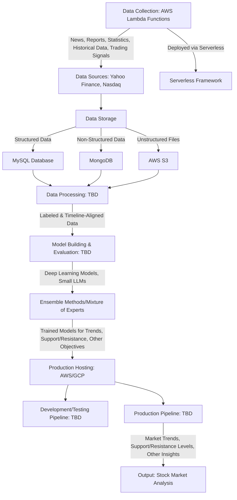

# Financial Market Trend Prediction System

## Overview
This project develops a system to train Large Language Models (LLMs) and Deep Learning models for multiple objectives: predicting financial market trends, identifying support and resistance levels, and other related tasks (e.g., risk assessment, volatility prediction). The system collects financial data from various sources using AWS Lambda functions, processes it, trains models, and deploys them to generate actionable insights for stock market analysis. The architecture supports diverse data sources, robust storage, and scalable cloud-based deployment.

## System Components
The system is divided into the following key components:

1. **Data Collection**:
   - Collects news, financial reports, company quarterly/annual reports, financial statistics, historical stock data, and trading strategy signals.
   - Uses multiple AWS Lambda functions, each tailored to collect specific data types (e.g., news, historical data, technical indicators) from different sources.
   - Lambda functions are deployed and managed using the Serverless Framework.

2. **Data Sources**:
   - Primary sources: Yahoo Finance and Nasdaq.
   - Data includes structured (numerical/statistical) and unstructured (reports, news) formats.

3. **Data Storage**:
   - **MySQL Database**: Stores structured data like financial statistics and historical data.
   - **MongoDB**: Stores non-structured data such as news articles and financial reports.
   - **AWS S3**: Stores unstructured files like chart images and other documents.

4. **Data Processing**:
   - Organizes news, reports, and statistics with timeline-based labels.
   - Processes technical indicator charts and trading signals, aligning them with timelines for model input (e.g., for trend prediction and support/resistance levels).
   - Processing logic is under development and will be defined in future scripts.

5. **Model Building and Evaluation**:
   - Trains and fine-tunes Deep Learning models and small LLMs on specific data types (e.g., news sentiment for trends, technical indicators for support/resistance).
   - Evaluates models for accuracy in trend prediction, support/resistance identification, and other objectives.
   - Training pipeline is under development.

6. **Ensemble Methods/Mixture of Experts**:
   - Combines specialized models (e.g., one for trend prediction, another for support/resistance levels) to improve prediction accuracy and robustness.

7. **Production Hosting**:
   - Deploys models on cloud platforms (AWS or GCP) for scalability.
   - Includes development/testing and production pipelines for continuous integration and deployment.
   - Deployment pipeline is under development.

## System and Data/Control Flow Diagram
The following diagram illustrates the system architecture and the flow of data and control between components:



### Diagram Explanation
- **Data Flow**:
  - AWS Lambda functions, deployed via Serverless, collect data from Yahoo Finance and Nasdaq, storing it in MySQL (structured), MongoDB (non-structured), and AWS S3 (unstructured files).
  - Processed data, labeled by timeline, is used to train models for trends, support/resistance levels, and other objectives.
  - Trained models are combined using ensemble methods and deployed to the cloud.
  - The production pipeline generates stock market analysis, including trends and support/resistance levels.
- **Control Flow**:
  - Lambda functions are orchestrated via Serverless for data collection.
  - Data processing, model training, and deployment pipelines are under development (TBD) but follow a linear flow from collection to output.

## Setup Instructions
1. **Prerequisites**:
   - MySQL for structured data storage.
   - MongoDB for non-structured data storage.
   - AWS S3 bucket for file storage.
   - AWS account with Lambda and Serverless Framework configured.
   - Cloud platform (AWS/GCP) for hosting.
   - Python environment with libraries for Deep Learning (e.g., TensorFlow, PyTorch) and data processing (e.g., Pandas, NumPy).
   - Serverless Framework CLI installed (`npm install -g serverless`).

2. **Installation**:
   ```bash
   # Clone the repository
   git clone <repository-url>
   cd financial-trend-prediction

   # Set up Python environment
   python -m venv venv
   source venv/bin/activate  # On Windows: venv\Scripts\activate
   pip install -r requirements.txt

   # Install Serverless Framework dependencies
   npm install
   ```

3. **Configuration**:
   - Configure MySQL database credentials in `config/mysql.yaml`.
   - Configure MongoDB connection in `config/mongodb.yaml`.
   - Set up AWS S3 access keys in `config/s3.yaml`.
   - Configure AWS credentials for Lambda in `config/aws.yaml`.
   - Define Serverless Framework settings in `serverless.yml` for Lambda functions.
   - Specify cloud provider settings in `config/cloud.yaml`.

4. **Deploying Lambda Functions**:
   ```bash
   # Deploy AWS Lambda functions using Serverless
   serverless deploy --stage prod
   ```

5. **Running the System**:
   ```bash
   # Trigger Lambda functions for data collection (configured in serverless.yml)
   serverless invoke --function <function-name>

   # Data processing (TBD)
   # python scripts/data_processing.py (to be defined)

   # Model training (TBD)
   # python scripts/model_training.py (to be defined)

   # Deployment (TBD)
   # python scripts/deployment.py (to be defined)
   ```

## Usage
- **Data Collection**: Deploy and invoke AWS Lambda functions via Serverless to fetch data from Yahoo Finance and Nasdaq.
- **Data Processing**: Placeholder for future scripts to label and align data for trends and support/resistance.
- **Model Training**: Placeholder for future scripts to train and evaluate models for multiple objectives.
- **Prediction**: Placeholder for future deployment scripts to generate stock market analysis, including trends and support/resistance levels.

## License
This project is licensed under the MIT License. See `LICENSE` for details.

## Contact
For questions or support, contact the project maintainer at <your-email@example.com>.